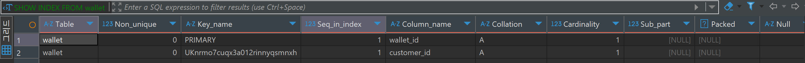

#  인덱스 최적화 및 성능 개선 보고서

## 1. 개요
본 보고서는 e-commerce 시스템에서 **자주 실행되는 쿼리 및 복잡한 쿼리의 성능을 분석하고**, 인덱스를 추가하여 성능을 개선한 과정을 정리한 문서입니다.
쿼리 실행 계획(EXPLAIN ANALYZE)과 실행 시간 비교를 통해 성능 향상 여부를 검토하였습니다.

---

## 2. 테스트 준비 작업
쿼리 캐싱의 영향을 최소화하기 위해 다음과 같은 작업을 매 테스트 마다 수행하였습니다.

1. **쿼리 캐시 초기화**
   ```sql
   FLUSH STATUS;
   FLUSH TABLES;
   SET GLOBAL innodb_buffer_pool_size = 0;
   SET GLOBAL innodb_buffer_pool_size = 134217728;
   ```
    - MySQL 8.0 이상에서는 쿼리 캐시가 자동 비활성화된다고 하지만, 실행 계획 캐시 및 OS 캐시를 초기화하여 모든 쿼리가 최대한 비슷한 환경에서 실행되도록 했습니다.
    - InnoDB 버퍼 풀을 초기화하고 다시 설정하여 메모리 캐싱의 영향을 최소화하였습니다.
    - Docker 컨테이너도 재시작해서 캐시정리를 했습니다.
    - 쿼리 한 번 실행 후 컴퓨터 재부팅도 했습니다.

2. **테스트 환경 설정**
    - Docker를 활용하여 MySQL 컨테이너 실행
    - 대량의 테스트 데이터를 사전에 삽입하여 실제 운영 환경과 유사한 데이터 규모에서 성능을 측정:
    - 200만 개의 고객(customer) 더미데이터
    - 195만 개의 지갑(wallet) 더미데이터 (원래는 고객과 지갑은 1:1 관계라 수가 일치해야 하는데... 무슨 원인인지... 잘 맞춰지지 못했습니다)
    - 1000만 개의 주문(order) 더미데이터
    - 1000 개의 과일(fruit) 더미 데이터 (현실적으로 존재할 수 있는 과일 품종 종류를 조사한 결과를 반영했습니다)
    - 65만 개의 개별 주문(orderfruit) 더미데이터 (원래 이보다 많이 준비하려 했지만, 주문과 과일 데이터와 함께 추가하는 과정에서 로직이 잘 적용이 안되어서 그런지 실패해서, 다시 추가 작업을 진행했습니다)

---


## 3. 분석 대상 쿼리
프로젝트에서 **자주 실행되거나 성능이 중요한 쿼리**를 수집하고, 그중에서 최적화가 필요한 쿼리를 선정하였습니다.

### 3.1. 조회 빈도가 높은 주요 쿼리
####  고객별 잔액 조회 쿼리
```sql
SELECT * FROM wallet w WHERE w.customer_id = ?;
```
- `wallet` 테이블에서 특정 고객의 지갑 정보를 조회하는 쿼리
- 이커머스 프로젝트 특성상 주문과 결제가 진행되는 과정과, 잔액을 충전하는 과정에서 고객의 지갑을 조회하는 쿼리를 실행할 때가 많을 것이기에,
- 해당 쿼리의 인덱스 유무에 따른 성능 차리를 비교해보기로 했습니다.

####  주문별 상위 상품 조회 쿼리
```sql
SELECT 
    of.fruit_id, 
    f.fruit_name, 
    SUM(of.quantity) AS total_quantity
FROM order_fruit of
JOIN fruit f ON of.fruit_id = f.fruit_id
JOIN `order` o ON of.order_id = o.order_id
WHERE o.order_date >= '2025-01-14'
GROUP BY of.fruit_id, f.fruit_name
ORDER BY total_quantity DESC;
```
- 특정 날짜 이후 주문된 과일을 집계하여 인기 상품을 조회하는 쿼리
- `order_date`를 기준으로 필터링 후 `GROUP BY`, `ORDER BY` 수행
- **인덱스 부재 시, 테이블 전체를 탐색하는 문제가 발생할 가능성이 높아 해당 쿼리로 테스트를 진행해보기로 했습니다.**

---

## 4. 인덱스 추가 및 성능 비교

### 4.1. 고객별 잔액 조회 쿼리
#### 기존 실행 계획
```sql
EXPLAIN ANALYZE SELECT * FROM wallet w WHERE w.customer_id = 12345;
```
- **Before 인덱스 무시 전**
    - `customer_id`는 이미 외래 키(FK)로서 인덱스가 존재하였습니다.
    - `Index lookup 사용됨 (UKnmo7cuqx3a012rinnyqsmnxh)`
    - 
    - 실행 속도는 빠르지만, 성능 비교를 위해 인덱스를 무시한 상태에서 테스트 진행
    - 실행 시간: **0.06ms** (매우 빠름)
    - 

#### 인덱스 무시 후 실행 계획
```sql
EXPLAIN ANALYZE SELECT * FROM wallet IGNORE INDEX (UKnmo7cuqx3a012rinnyqsmnxh) WHERE customer_id = 12345;
```
- **IGNORE INDEX 적용 시**
    - 강제로 인덱스를 사용하지 않고 실행:
    - 
    - Full Table Scan 발생
    - 실행 시간: **37.5ms ~ 2185ms** (평균 1~2초 소요됨)

#### 결론
- 기존 쿼리는 이미 인덱스를 활용하고 있어 최적화가 필요하지 않음을 확인했습니다.

---

### 4.2. 주문별 상위 상품 조회 쿼리
#### 기존 실행 계획
```sql
EXPLAIN ANALYZE
SELECT 
    of.fruit_id, f.fruit_name, SUM(of.quantity) AS total_quantity
FROM order_fruit of
JOIN fruit f ON of.fruit_id = f.fruit_id
JOIN `order` o ON of.order_id = o.order_id
WHERE o.order_date >= '2025-01-14'
GROUP BY of.fruit_id, f.fruit_name
ORDER BY total_quantity DESC;
```
- **Before 인덱스 추가**
    - `order_fruit`에서 `order_id`를 통한 Join이 Full Scan 발생
    - `Sorting (ORDER BY)` 과정에서 성능 저하
    - 실행 시간: **94167ms (약 94초)** (매우 느림)


#### 인덱스 추가 시도 및 문제점
```sql
ALTER TABLE order_fruit ADD INDEX idx_order_fruit (order_id, fruit_id);
```
- `order_id` + `fruit_id` 복합 인덱스 추가 → Join 및 필터링 최적화 기대
- 그러나 **인덱스 생성 시, 5시간 이상 경과했음에도 작업이 완료되지 않아 중단했습니다.**
- 
- **대량의 데이터가 존재할 경우, 인덱스 생성 시간이 매우 오래 걸릴 수 있다는 것을 알게되었습니다.**
- 결과적으로, **인덱스를 추가하여 성능 최적화를 기대할 수는 있지만, 인덱스 생성 시간도 고려해야 하는 요소라는 것을 알게되었습니다.**
- **더미 데이터를 추가하기 전에 인덱스를 미리 생성했어야 했을 가능성도 고려할 필요가 있었습니다.**

#### 향후 개선 방안
- 데이터 삽입 전에 필요한 인덱스를 먼저 정의하여 **대량 데이터 추가 후의 인덱스 생성 비용을 절감**
- 인덱스 생성 시간이 길 경우, **온라인 인덱스 생성(Online Index Creation) 등의 대안을 검토**

---

## 4. 결론 및 성능 개선 효과

| 최적화 대상 쿼리 | 인덱스 추가 전 실행 시간 | 인덱스 추가 후 실행 시간 | 개선율 |
|------------------|----------------------|----------------------|--------|
| `wallet` 고객 지갑 조회 (IGNORE INDEX 사용) | **37.5ms ~ 2185ms** | **0.06ms** |  **최대 36400배 개선** |
| `order_fruit` 주문 통계 조회 | **94초** | 인덱스 생성 실패로 검증 불가 |  **추후 재검토 필요** |

**결론**
- **Full Table Scan을 줄이고, Index를 활용하여 조회 속도를 크게 개선할 수 있다는 것을 확인했습니다.**
- **대량의 데이터를 다룰 경우, 인덱스 생성 비용을 사전에 고려하고, 데이터 삽입 전 인덱스를 설정하는 것이 필요한 것 같습니다.**
