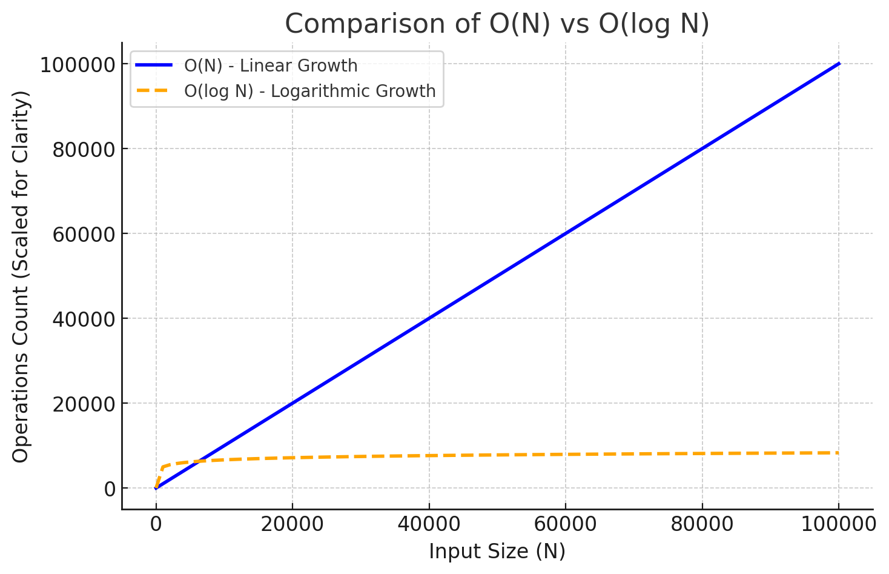
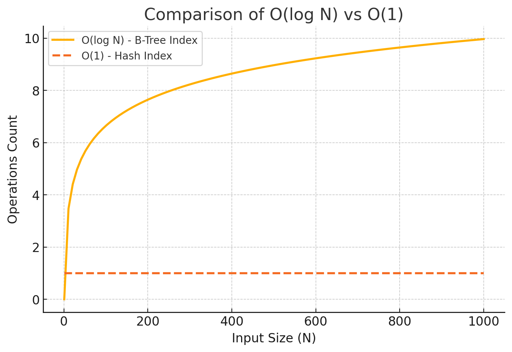

# 조회가 오래 걸리는 쿼리 캐싱 및 로직 개선

조회 성능을 저하시킬 수 있는 다음과 같은 요인들이 있습니다.
1. 필요한 데이터 탐색 과정에서 불필요한 데이터까지 조회해야 하는 경우 (예: Full Table Scan, FTS)
2. 락(Lock)이 걸려 있어 대기 시간이 길어지는 경우
이 외에도 다양한 요인이 존재하지만, 본 보고서에서는 위 두 가지를 중심으로 분석하겠습니다.

본 보고서는 조회 성능 저하의 원인과 이를 개선할 수 있는 캐싱 기법에 대해 다룹니다.
각 요인에 대한 이론적 분석과 함께, 이를 선착순 쿠폰 로직에 적용해보겠습니다.

1️⃣불필요한 데이터까지 조회해야 하는 경우

인덱스가 없는 컬럼을 WHERE절에서 사용하면, 데이터 베이스는 테이블의 모든 행을 스캔(Full Table Scan, FTS)해야 하므로 조회가 오래 걸립니다. 



가장 일반적인 B-Tree 인덱스와 비교해보면 인덱스 없이 WHERE 절을 이용한 탐색의 시간 복잡도는 O(N), B-Tree 인덱스를 활용한 탐색의 시간 복잡도는 O(log N)입니다.

WHERE 절에서 인덱스를 사용하지 않으면, 입력 크기 N이 증가할수록 조회 연산량이 O(N)으로 선형적으로 증가합니다(파란 선). 반면, 인덱스를 활용하면 O(log N)으로 증가폭이 완만해져, N이 커져도 상대적으로 적은 연산량으로 데이터를 조회할 수 있습니다(노랑 점선). 이는 인덱스를 활용하여 검색 범위를 좁혀나가며 불필요한 연산을 줄일 수 있기 때문입니다.

이쯤에서 현재 저의 쿠폰 지급 로직을 검토해보겠습니다.

```java
@Transactional(propagation = Propagation.REQUIRED)
    public CouponIssue issueCoupon(Long couponId, Long customerId) {
        // 1. 쿠폰 조회
        Coupon coupon = couponRepository.findByIdForUpdate(couponId)
                .orElseThrow(() -> new BaseCustomException(BaseErrorCode.NOT_FOUND, new String[]{"쿠폰이 존재하지 않습니다."}));

        // 2. 고객 조회
        Customer customer = customerRepository.findById(customerId)
                .orElseThrow(() -> new BaseCustomException(BaseErrorCode.NOT_FOUND, new String[]{"고객이 존재하지 않습니다."}));

        // 3. 중복 발급 확인
        Optional<CouponIssue> issuedCoupon = couponIssueRepository.findIssuedCoupon(couponId,customerId);
        if(issuedCoupon.isPresent()){
            throw new BaseCustomException(BaseErrorCode.ALREADY_ISSUED_COUPON,new String[]{coupon.getCouponName()});
        }

        // 4. 쿠폰 발급 처리
        coupon.issueCoupon(); // 발급 가능 여부 확인 및 발급 수량 증가
        CouponIssue couponIssue = CouponIssue.create(coupon, customer);
        return couponIssueRepository.save(couponIssue);
    }
```

쿠폰을 발급하여 CouponIssue 데이터를 저장하기 전, 총 3회의 조회 연산이 수행됩니다. 다행히 Coupon, Customer, CouponIssue 엔터티는 모두 해당 테이블의 PK를 가지고 있습니다(Primary Key가 인덱스 역할을 합니다).

```java
//쿠폰 엔터티
@Entity
@Getter
@Builder
@NoArgsConstructor(access = AccessLevel.PROTECTED)
@AllArgsConstructor(access = AccessLevel.PRIVATE)
public class Coupon {
    @Id//@Id를 설정하면 해당 필드는 PRIMARY KEY가 됩니다
    @GeneratedValue(strategy = GenerationType.IDENTITY)
    private Long couponId;

    @Column(nullable = false)
    private String couponName;

    @Column(nullable = false)
    private int discountAmount;

    @Column(nullable = false)
    private int maxQuantity;

    @Column(nullable = false)
    private int issuedCount;

//...이하 생략
}

//고객 엔터티
@Entity
@Getter
@NoArgsConstructor(access = AccessLevel.PROTECTED)
@AllArgsConstructor(access = AccessLevel.PRIVATE) 
@Table(name = "customer")
public class Customer {

    @Id//@Id를 설정하면 해당 필드는 PRIMARY KEY가 됩니다
    @GeneratedValue(strategy = GenerationType.IDENTITY)
    private Long customerId;

    @Column(nullable = false)
    private String customerName;

    @Column(nullable = false)
    private String customerAddress;

    @Column(nullable = false)
    private String customerPhone;

    @OneToOne(mappedBy = "customer")
    private Wallet wallet;

//...이하 생략
}

//발급된 쿠폰 엔터티
@Entity
@Getter
@Builder
@NoArgsConstructor(access = AccessLevel.PROTECTED)
@AllArgsConstructor(access = AccessLevel.PRIVATE)
public class CouponIssue {

    @Id//@Id를 설정하면 해당 필드는 PRIMARY KEY가 됩니다
    @GeneratedValue(strategy = GenerationType.IDENTITY)
    private Long couponIssueId;

    @ManyToOne(fetch = FetchType.LAZY)
    @JoinColumn(name = "coupon_id", nullable = false)
    private Coupon coupon;

    @ManyToOne(fetch = FetchType.LAZY)
    @JoinColumn(name = "customer_id", nullable = false)
    private Customer customer;

    @Column(nullable = false)
    private LocalDateTime issuedAt;

    @Column(nullable = true)
    private LocalDateTime usedAt;

    @Column(nullable = true)
    private LocalDateTime expiredAt;

    @Enumerated(EnumType.STRING)
    @Column(nullable = false)
    private CouponStatus status;

//...이하 생략
}
```

PK를 사용해서 데이터를 조회할 때는 "Index Seek"가 수행되므로, FTS 발생 없이 B-Tree 탐색을 통해 O(logN) 시간 복잡도로 데이터가 조회됩니다.

인덱스에는 B-Tree 인덱스 외에도 Hash 인덱스, Full-Text 인덱스, Bitmap 인덱스 등이 있습니다. 그 중에서도 Redis의 조회 방식과 가장 유사한 Hash 인덱스의 특징을 분석해보겠습니다.



Hash 인덱스는 해시 함수(Hash Function)를 사용하여 Key 값을 해시 값으로 변환한 후, 해당 값을 기반으로 데이터를 저장합니다. 조회 시, 동일한 해시 함수를 적용하여 해시 값을 계산하고, 해당 해시 값이 저장된 슬롯(Bucket)에서 데이터를 즉시 가져올 수 있습니다.

이 방식은 메모리 주소를 직접 참조하는 방식과 유사하지만, 해시 테이블 내부에서 별도의 슬롯에 데이터를 저장한다는 점에서 차이가 있습니다.

따라서, 해시 테이블의 크기가 적절히 유지되고 해시 충돌이 적다면*, 평균적으로 O(1)의 속도로 데이터를 조회할 수 있습니다. 이는 특정 Key 조회에서는 B-Tree 인덱스(O(log N))보다 빠를 수 있습니다.

*해시 테이블의 크기가 너무 작으면, 동일한 해시 값을 갖는 Key가 증가하면서 충돌이 많아지고, 결국 조회 속도가 O(N)까지 느려질 수 있습니다. 

Redis와 Hash 인덱스는 모두 해시 값을 기반으로 O(1)의 조회 속도를 가지지만, 저장 방식과 목적에서 차이가 있습니다. Hash 인덱스는 데이터베이스(DB)에서 특정 Key 값의 조회를 빠르게 수행하는 것이 목적이며, 일반적으로 영속적인 스토리지(DB 디스크)에 데이터를 저장합니다. 

반면, Redis는 메모리 기반 저장소에 데이터를 저장하고, 요청 시 빠르게 반환하는 캐싱 기법을 통해 빠른 응답을 제공합니다. 또한, 단시간에 대량의 저장 및 조회 요청을 처리할 수 있도록 최적화되어 있습니다.

다시 기존의 선착순 쿠폰 발급 기능을 검토해보겠습니다.

```java
@Transactional(propagation = Propagation.REQUIRED)
    public CouponIssue issueCoupon(Long couponId, Long customerId) {
        // 1. 쿠폰 조회
        Coupon coupon = couponRepository.findByIdForUpdate(couponId)
                .orElseThrow(() -> new BaseCustomException(BaseErrorCode.NOT_FOUND, new String[]{"쿠폰이 존재하지 않습니다."}));

        // 2. 고객 조회
        Customer customer = customerRepository.findById(customerId)
                .orElseThrow(() -> new BaseCustomException(BaseErrorCode.NOT_FOUND, new String[]{"고객이 존재하지 않습니다."}));

        // 3. 중복 발급 확인
        Optional<CouponIssue> issuedCoupon = couponIssueRepository.findIssuedCoupon(couponId,customerId);
        if(issuedCoupon.isPresent()){
            throw new BaseCustomException(BaseErrorCode.ALREADY_ISSUED_COUPON,new String[]{coupon.getCouponName()});
        }

        // 4. 쿠폰 발급 처리
        coupon.issueCoupon(); // 발급 가능 여부 확인 및 발급 수량 증가
        CouponIssue couponIssue = CouponIssue.create(coupon, customer);
        return couponIssueRepository.save(couponIssue);
    }
```

선착순 쿠폰 기능은 단시간에 특정 쿠폰에 대한 대량의 발급 요청을 빠르게 처리해야 합니다. 따라서 조회 성능을 높이는 Hash 인덱스는 트랜잭션 처리에는 적절하지 않으므로, Redis를 이용한 캐싱 기법을 적용하는 것이 더 효과적입니다.

쿠폰 발급 처리를 하기 전에 실행되는 조회 기능들을 검토해보겠습니다.

1. 쿠폰 조회
선착순 쿠폰을 지급할 때, 특정 쿠폰에 대한 요청을 빠르게 처리하는 것이 중요합니다. 따라서 해당 쿠폰 정보를 메모리에 저장하여 조회하는 것이 더 효율적입니다. 이를 위해, 첫 조회 요청이 들어오면 DB에서 쿠폰 정보를 조회한 후, 동시에 캐시에 저장하는 Read-Through Caching을 적용하는 것이 적절합니다.

2. 고객 조회
고객 정보는 자주 조회되지만 변경되는 빈도는 상대적으로 낮습니다. 따라서 쿠폰 조회와 동일하게 Read-Through Caching을 적용하는 것이 효율적입니다. 단, 고객 정보가 수정될 경우에는 기존 캐시를 삭제하고, 최신 데이터를 반영할 수 있도록 Write-Through Caching 전략을 적용하는 것이 적절합니다.

3. 중복 발급 검증 및 데이터 저장 전략
캐싱을 적용하면서, 쿠폰 발급 과정에서 DB 락을 사용하는 방식보다 더 유연한 로직을 구성할 수 있습니다.
이전에는 쿠폰이 이미 발급되었는지 매번 DB에서 조회해야 했지만, 이제는 쿠폰 발급 정보를 캐싱하여 더욱 효율적으로 중복 발급 여부를 검증할 수 있습니다.

중복 발급 여부를 신속하게 확인하기 위해 쿠폰 발급 정보를 캐시에 저장하지만, 동시에 데이터가 즉시 DB에도 반영되어야 합니다.
데이터를 먼저 캐시에 저장한 후, 일정 시간이 지나면 DB에 반영하는 Write-Back Caching 기법도 있지만, 쿠폰 발급 정보는 즉시 DB에 반영되어야 하는 중요한 데이터입니다.

이러한 설계는 IT 서비스 관리(ITSM) 및 IT 일반 통제(ITGC) 원칙과도 관련이 있습니다.

ITSM 관점에서는 장애 발생 시 데이터 유실 없이 즉시 복구 가능해야 하며, 시스템의 신뢰성을 유지하는 것이 중요합니다.
ITGC 관점에서는 중요한 트랜잭션 정보가 실시간으로 저장되고 변경 사항이 즉각 반영되어야 하며, 데이터 유실이 발생할 경우 감사(Audit) 및 규제 대응이 어려울 수 있습니다.
따라서, 쿠폰 발급 데이터는 Write-Back Caching보다 Write-Through Caching이 더 적절하며, DB와 캐시에 동시에 반영하여 데이터 일관성을 보장하는 방식이 바람직합니다.

4. 캐시 만료(TTL) 설정 필요성
쿠폰 발급 정보는 DB와 캐시에 함께 저장되므로, 추가적인 DB 이관 작업이 필요하지 않습니다.
다만, 중복 발급 여부를 빠르게 확인해야 하는 쿠폰 발급 기간이 종료된 이후에는, 해당 데이터를 캐시에 보관할 필요가 없습니다.
따라서, 선착순 쿠폰 지급이 끝난 후 일정 시간이 지나면, 캐시를 자동으로 비우도록 TTL(Time-To-Live) 설정을 적용하는 것이 적절합니다.

캐싱을 활용하여 요청을 빠르게 처리함으로써, 선착순 쿠폰 발급 로직의 성능을 개선할 수 있었습니다.
그러나, 여전히 단시간 내에 많은 고객의 요청을 안정적으로 처리하기에는 여전히 부족한 점이 남아 있습니다.

특히, 쿠폰 발급 요청이 동시에 여러 서버에서 실행될 경우, DB에 락(Lock)이 걸리면서 발생하는 대기 시간 증가 문제를 해결해야 합니다.

다음 장에서는 조회 성능을 저하시킬 수 있는 또 다른 요인인 'DB 락'에 대해 논의하고,
이를 해결하기 위한 대안으로 Redis 기반의 INCR 방식을 적용하여 선착순 쿠폰 지급 기능을 더욱 개선하는 방법을 살펴보겠습니다.

2️⃣ 락(Lock)이 걸려 있어 대기 시간이 길어지는 경우

기존 선착순 쿠폰 발급 로직은 **비관적 락(Pessimistic Lock)**을 적용하여, 한 번에 하나의 요청만 쿠폰 발급을 진행하도록 처리되었습니다.

```java
//발급할 쿠폰 정보 조회 시 비관적 락 적용
public interface CouponJpaRepository extends JpaRepository<Coupon,Long> {
    @Lock(LockModeType.PESSIMISTIC_WRITE)
    @Query("SELECT c FROM Coupon c WHERE c.couponId = :couponId")
    Optional<Coupon> findByIdForUpdate(@Param("couponId") Long couponId);
}
```

즉, 첫 번째 요청이 완료될 때까지, 이후 요청들은 모두 대기 상태가 됩니다.

이 방식은 은행 창구를 하나만 운영하는 것과 같습니다.
즉, 첫 번째 고객이 창구에서 요청을 처리하는 동안, 다음 고객들은 줄을 서서 기다려야 합니다.
처리는 안정적이지만, 동시에 여러 고객을 응대할 수 없어 대기 시간이 길어지는 문제가 발생합니다.

그러나, Redis의 INCR(또는 DECR)을 활용하면 더 빠르고 효율적인 방식으로 쿠폰을 발급할 수 있습니다.
이는 창구를 여러 개 운영하는 것뿐만 아니라, 각 창구에서 동시에 고객의 요청을 처리할 수 있도록 하는 방식과 유사합니다.

즉, 모든 고객이 대기할 필요 없이, 쿠폰이 남아있는 경우 즉시 발급을 받을 수 있습니다.
각 요청은 별도의 락을 사용하지 않고, Redis의 DECR 연산을 활용하여 트랜잭션 없이 빠르게 쿠폰 재고를 차감합니다.

이 방식에서는 각 요청이 개별적으로 실행되므로, 한 서버가 락을 점유하여 다른 요청을 차단하는 일이 발생하지 않습니다.
따라서 전체적인 처리 속도를 크게 향상시키면서도, 중복 발급을 방지할 수 있습니다.

다음은 Redis 기반의 DECR 연산을 활용해서 쿠폰을 지급하는 과정에 대해 설명해보겠습니다.

기존의 쿠폰 지급 로직은 지급 트랜잭션이 실행되기 전, 검증을 위한 조회 로직들이 있었지만, DECR 연산을 활용하면 중복 발급 검증 확인 → 쿠폰 재고 차감 → 쿠폰 발급 정보를 DB에 저장 → 쿠폰 발급 정보를 Redis에 저장하는 순서로 진행됩니다.

1. 중복 발급 검증

기존 방식에서는 쿠폰 발급 여부를 DB에서 조회했지만, 이 방식은 트랜잭션 비용이 크고 성능 저하를 초래할 수 있습니다.

중복 발급 여부를 캐시에서 확인함으로써 빠르게 검증하는 것이 더 효율적입니다:

Redis에 고객이 해당 쿠폰을 발급받았는지 확인합니다.

```java
        Boolean alreadyIssued = redisTemplate.hasKey(issuedKey);
        if (Boolean.TRUE.equals(alreadyIssued)) {
            return false; // 이미 발급된 쿠폰
        }
```

이 방식은 중복 발급을 방지하면서도, 빠른 응답 속도를 유지할 수 있습니다.

2. 쿠폰 재고 관리 (DECR을 활용한 빠른 트랜잭션 처리)

기존 방식에서는 DB에서 쿠폰 재고를 조회한 후, 수량을 갱신하는 과정에서 락이 발생하여 처리 속도가 저하되었습니다.
이 과정에서 대량의 동시 요청이 들어오면, 트랜잭션 충돌이 발생하여 응답 지연이 발생할 가능성이 큽니다.

이를 해결하기 위해 Redis의 DECR 연산을 활용하여, 쿠폰 재고를 빠르게 관리하는 방식이 적절합니다.

Redis DECR 연산을 활용한 재고 감소 과정은 다음과 같습니다:

- 쿠폰 발급 요청이 들어오면, Redis의 DECR 연산을 실행하여 즉시 재고를 차감합니다.

- DECR 연산은 락 없이 원자적으로 실행되므로, 초과 발급을 방지하면서도 빠르게 동작합니다.
차감 후 재고가 0 이상이면 발급 성공, 0 미만이면 즉시 롤백 처리를 해서 초과 발급을 방지합니다.

```java
        Long stock = redisTemplate.opsForValue().decrement(stockKey);
        if (stock == null || stock < 0) {
            redisTemplate.opsForValue().increment(stockKey); // 롤백 (초과 발급 방지)
            return false;
        }
```

3. 쿠폰/고객 조회 (Cache-Aside 방식 활용)

발급할 쿠폰과 쿠폰을 발급할 고객 정보를 조회하는 과정에서 기존 DB 조회 방식은 병목을 유발할 수 있습니다.
이를 해결하기 위해 Cache-Aside 방식을 적용하여, 쿠폰과 고객 정보를 캐시에 저장한 후 필요할 때 조회하는 것이 더 효율적입니다.

```java
    public Coupon getCoupon(Long couponId) {
        String key = "coupon:" + couponId;

        // Step 1: Redis에서 조회
        Coupon cachedCoupon = (Coupon) redisTemplate.opsForValue().get(key);
        if (cachedCoupon != null) {
            return cachedCoupon;
        }

        // Step 2: Redis에 없으면 DB에서 조회 후 캐싱
        Coupon coupon = couponRepository.findById(couponId)
                .orElseThrow(() -> new BaseCustomException(BaseErrorCode.NOT_FOUND, new String[]{String.valueOf(couponId)}));
        redisTemplate.opsForValue().set(key, coupon, Duration.ofHours(1));

        return coupon;
    }

    public Customer getCustomer(Long customerId) {
        String key = "customer:" + customerId;

        // Step 1: Redis에서 조회
        Customer cachedCustomer = (Customer) redisTemplate.opsForValue().get(key);
        if (cachedCustomer != null) {
            return cachedCustomer;
        }

        // Step 2: Redis에 없으면 DB에서 조회 후 캐싱
        Customer customer = customerRepository.findById(customerId)
                .orElseThrow(() -> new BaseCustomException(BaseErrorCode.NOT_FOUND, new String[]{String.valueOf(customerId)}));
        redisTemplate.opsForValue().set(key, customer, Duration.ofHours(1));

        return customer;
    }
```

4. 쿠폰 발급 처리

쿠폰 발급을 진행하고, Redis에 해당 정보를 저장합니다 (SET).

쿠폰 발급 데이터는 DB에도 즉시 반영하여, 장애 발생 시에도 데이터 정합성을 보장합니다.

```java
			  // Step 4: 쿠폰 발급 처리 (발급 가능 여부 확인 및 issuedCount 증가)
        coupon.issueCoupon(); // `issuedCount` 증가 (쿠폰 재고 관리)

        // Step 5: 쿠폰 발급 정보를 DB에 저장
        CouponIssue couponIssue = CouponIssue.create(coupon, customer);
        couponIssueRepository.save(couponIssue);

        // Step 6: Redis에 발급 정보 저장 (중복 방지 + TTL 설정)
        redisTemplate.opsForValue().set(issuedKey, "true", Duration.ofDays(1));

        return true; // 쿠폰 발급 성공
```

5. TTL(Time-To-Live) 설정을 활용한 캐시 최적화

쿠폰 발급 정보는 DB와 캐시에 함께 저장되므로, 추가적인 데이터 동기화 작업이 필요하지 않습니다.
중복 발급 여부를 빠르게 확인해야 하는 쿠폰 발급 기간이 종료된 이후에는, 해당 데이터를 캐시에 보관할 필요가 없습니다.

따라서 Redis TTL(Time-To-Live) 설정을 적용하여, 일정 시간이 지나면 자동으로 캐시 데이터를 삭제하는 방식이 적절합니다.

TTL을 설정하는 방식은 다음과 같습니다:

- 쿠폰 발급 정보는 24시간 동안 캐시에 유지한 후 자동 삭제됩니다.
- 쿠폰 재고 정보는 선착순 이벤트 종료 후 자동 삭제됩니다.
이 방식을 활용하면 캐시가 불필요하게 과부하되지 않으며, 데이터 일관성을 유지할 수 있습니다.

```java
redisTemplate.opsForValue().set(issuedKey, "true", Duration.ofDays(1));
redisTemplate.expire(stockKey, Duration.ofHours(1));
```