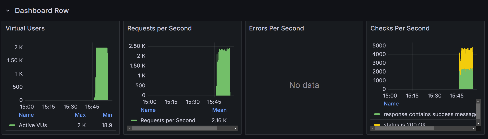
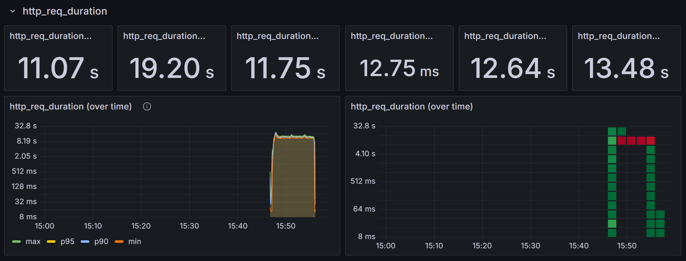
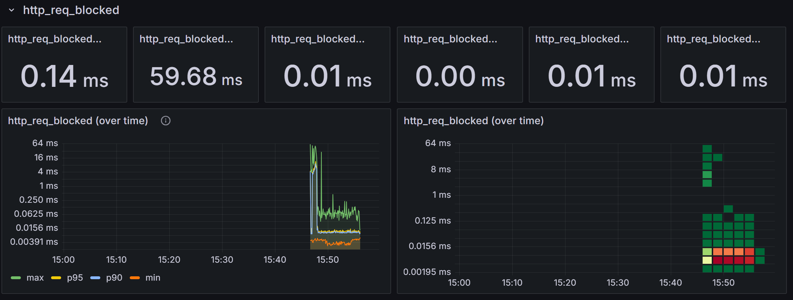

# 부하 테스트 결과 보고서 - 상품 주문 기능

## 1. 개요
본 문서는 **상품 주문 기능**에 대한 부하 테스트 수행 결과를 정리한 보고서입니다.  
테스트 계획에 따라 실행한 부하 테스트의 주요 결과와 분석 내용을 포함합니다.

---

## 2. 테스트 개요
### 2.1 테스트 대상
- **API 엔드포인트**: `/api/orders` (POST)
- **동시 사용자 수**: 최대 2000명
- **테스트 도구**: k6
- **테스트 기간**: 9분 30초

### 2.2 테스트 목적
- 동시 주문 요청 시 서버가 처리할 수 있는 최대 처리량 확인
- 응답 속도 및 성능 저하 발생 여부 파악
- 서버 부하 분산 및 성능 최적화 필요성 분석

---

## 3. 테스트 수행 결과

### 3.1 주요 성능 지표
| 지표 | 값 | 설명 |
|------|------|------|
| 평균 응답 시간 | **11.07초** | 목표 초과 (2초 이내 실패) |
| 최대 응답 시간 | **19.2초** | 성능 저하 발생 |
| 초당 요청 수 (RPS) | **2160** | 예상 범위 |
| 요청 실패율 | **0%** | 오류 없음 |
| 최대 사용자 수 | **2000명** | 정상 수행 |

### 3.2 응답 시간 분석 (`http_req_duration`)
- **평균 응답 시간**: **11.07초**
- **최대 응답 시간**: **19.2초**
- **최소 응답 시간**: **12.75ms**
- **95% 퍼센타일(p95) 응답 시간**: **13.47초**
- **응답 시간이 너무 길어 부하가 증가할 경우 성능 저하가 심각함**.

### 3.3 서버 요청 처리량 (`requests per second`)
- **초당 요청 수 (RPS)**: **2160**
- **2000명의 동시 접속에서 서버가 정상적으로 요청을 처리했지만, 응답 속도가 느려짐**.

### 3.4 요청 차단 시간 (`http_req_blocked`)
- **평균 요청 차단 시간**: **0.14ms**
- **최대 요청 차단 시간**: **59.68ms**
- **대기열이 발생할 가능성이 있으므로 부하 분산 필요**.

---

## 4. 분석 및 개선 방향
### 4.1 분석 결과

- 응답 시간이 **목표(2초)보다 너무 길다** → **최적화 필요**
- 서버가 동시 요청을 **정상적으로 처리하긴 했지만, 응답 지연이 심함**
- **서버 확장 및 부하 분산 없이는 서비스 품질 저하 위험**

### 4.2 개선 방향
#### 1️⃣ **DB 성능 최적화**
- 주문 시 데이터베이스 트랜잭션을 최적화하여 **쿼리 성능 향상** 필요
- **Redis 캐싱**을 활용하여 자주 조회되는 데이터를 미리 저장

#### 2️⃣ **서버 확장 (Scaling)**
- **Auto Scaling** 및 **로드 밸런싱**을 활용하여 부하를 분산
- 클러스터 환경에서 API 서버를 **수평 확장(Scale-out)**

#### 3️⃣ **비동기 처리 도입**
- 주문 요청을 **비동기 큐(Kafka, RabbitMQ 등)로 전환**하여 속도 개선
- DB 트랜잭션을 최소화하여 **비동기 방식으로 처리 속도 향상**

#### 4️⃣ **트래픽 관리**
- 비정상적인 과부하 방지:
  - **Rate Limiting(요청 수 제한)** 적용
    - 비정상적인 부하는 차단하는 방법
  - **Throttling (트래픽 조절)** 적용
    - 요청 처리 속도를 일정 속도로 제한
- API Gateway에서 부하를 분산하는 전략 적용

---

## 5. 결론 및 향후 계획
### **결론**
- 서버는 **2000명 동시 요청을 감당할 수는 있었으나, 응답 시간이 너무 느려 실사용에 문제가 될 수 있습니다**.
- 서버 부하 시 **응답 시간 증가가 심각**하여 최적화가 필요해보입니다.

### **향후 계획**
1. **API 최적화 후 재테스트 진행**
2. **DB 및 캐싱 구조 개선 후 부하 테스트 재수행**
3. **서버 확장 방안 검토 (로드 밸런서, Auto Scaling 도입)**
